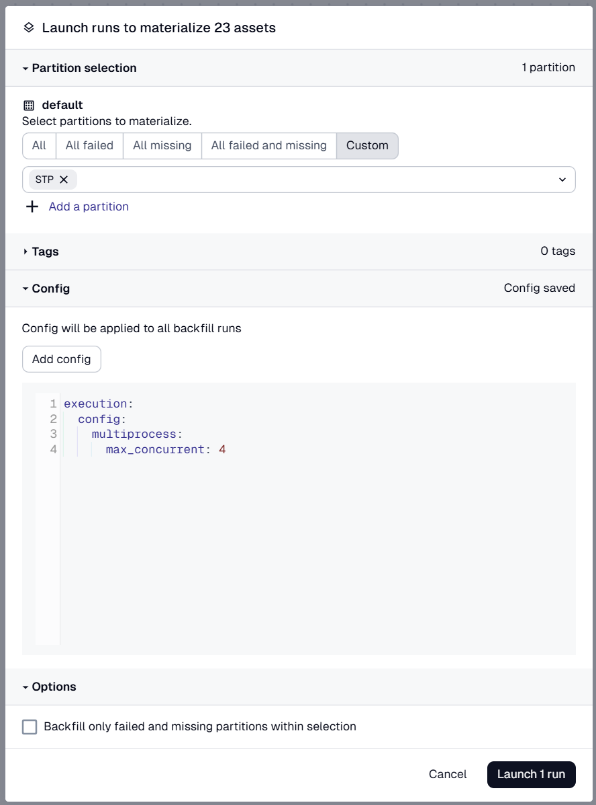

# OSM-QUALITY-COUNTRY-REPORTS

## Install the dependencies

Make sure that you set the `DAGSTER_HOME` in an `.env` file like it's done in `.example.env`.


### uv
If you do not have uv installed, you can do so in a [number of ways](https://docs.astral.sh/uv/getting-started/installation/). To install the python dependencies with uv. While in the course specific directory run the following:
```sh
uv sync
```
This will create a virtual environment and install the required dependencies. To enter the newly created virtual environment:
| OS      | Command                  |
|---------|--------------------------|
| MacOS   | `source .venv/bin/activate` |
| Windows | `.venv\Scripts\activate`   |
### pip
To install the python dependencies with pip. While in the course specific directory run the following:
```sh
python3 -m venv .venv
```
To install the required dependencies:
```sh
pip install -e ".[dev]"
```

## Project structure
Using dg to scaffold your project will ensure that files are placed in the correct location. We can ensure that everything is configured correctly also using dg.
```sh
dg check defs
```

Use the command line to run the following command in the root of your Dagster project to start the pipeline.
```sh
dg dev
```
Navigate to localhost:3000 in your browser.

### helpful tip

if you want to limit the amount of assets running at the same time, add the following to the config:



```sh
execution:
  config:
    multiprocess:
      max_concurrent: 4
```